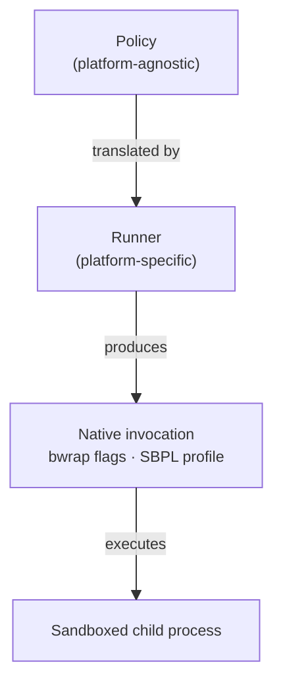
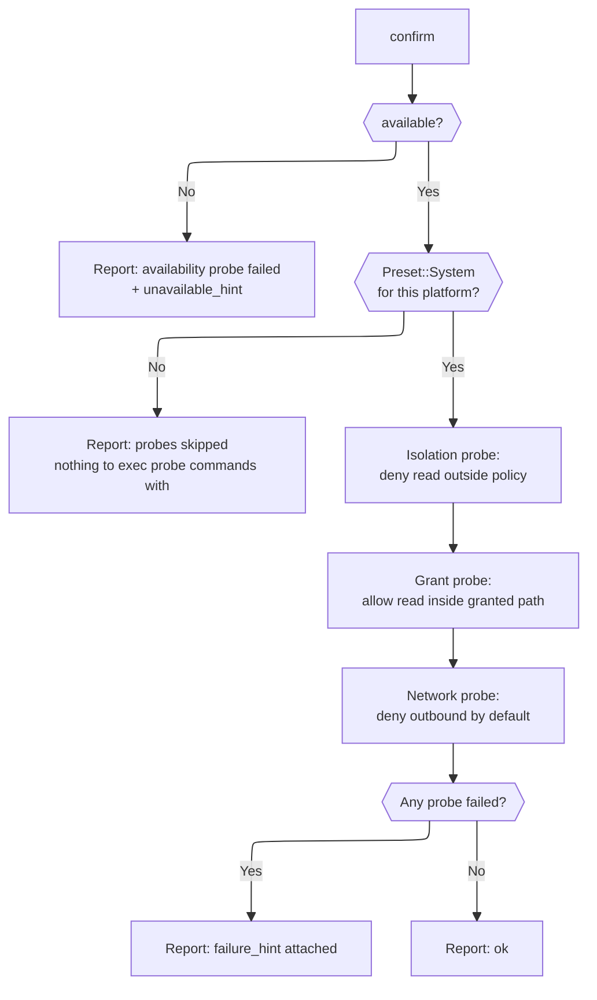
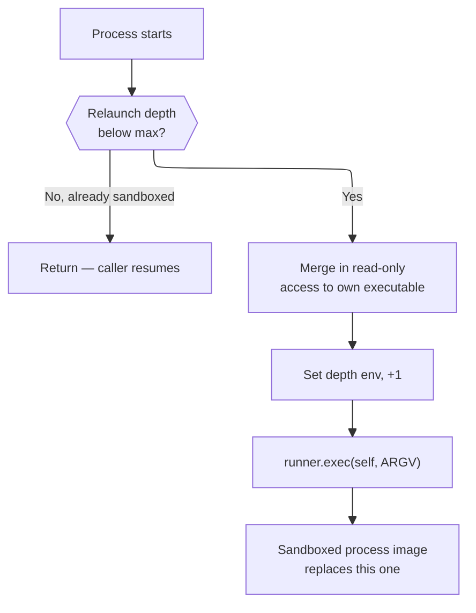
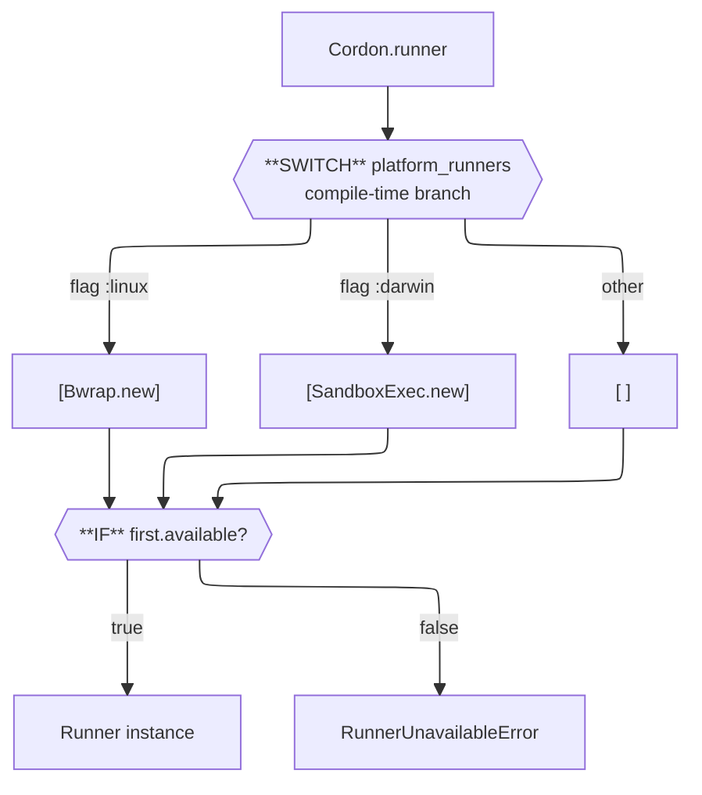

# Cordon Development

## Dependencies

1. Make sure you have `ops` installed, in one of the following ways:
   - as a gem via `gem install ops_team` or
   - as a tool via `brew tap nickthecook/crops && brew install ops`
2. If you are not using macOS, or a Linux that uses `apt`, please [install Crystal](https://crystal-lang.org/install/)

## Getting started

|Command                        |Description                                                                  |
|-------------------------------|-----------------------------------------------------------------------------|
|`ops up`                       |Gets everything set up including `crystal` via `apt` or `brew` if applicable.|
|`ops build-debug` or `ops bd`  |Make a debug build of `cordon`, in `bin/debug` folder.                       |
|`ops build-release` or `ops br`|Make a release / production build of `cordon`, in `bin/release` folder.      |
|`ops lint`                     |Run `ameba` on the source code.                                              |
|`ops test`                     |Run `crystal spec` on the source code.                                       |
|`ops clean`                    |Remove debug and release build files.                                        |
|`ops wipe`                     |In addition to cleaning, remove all compiler caches.                         |

### Build and run for development

Compile and run the `cordon` CLI as follows. Note that we use `--` separator twice, first to tell `crystal` which parameters to pass on to the running program, the second is to `cordon` so it knows the command to run in the sandbox.

```
ops run src/sandboxer_cli.cr -- run --policy YOUR_POLICY.json -- YOUR_COMMAND
```

### Build to run later

Run `ops build-release` to make a release build in `bin/release/`.

Run `ops build-debug` to make a debug build in `bin/debug/`.

## How Cordon works

### Design overview

Cordon is a thin translation layer. The core idea is that Linux (`bwrap`) and macOS (`sandbox-exec`) both let you wrap an arbitrary command in a sandbox — the same shape, different native languages. Cordon defines a platform-agnostic `Policy` that describes *what a process should be allowed to do*, and a `Runner` per platform that translates that policy into a native invocation.



Nothing in `Policy` knows about bwrap or SBPL. Nothing in a `Runner` is exposed at the library API surface beyond `available?` and `run`. This makes it straightforward to add a new platform without touching anything else.

The library entry point (`cordon.cr`) and the CLI entry point (`sandboxer_cli.cr`) are intentionally separate files. Users who `require "cordon"` get the library with no CLI code. The CLI requires the library and adds the `Cordon::CLI` module on top.

### The Policy

`Cordon::Policy` is a plain data class that captures what a sandboxed process is permitted to access. Every field has a safe default (deny network, empty path lists, new session). The full set of dimensions:

|Field             |Type                  |Default|Meaning                                              |
|------------------|----------------------|-------|-----------------------------------------------------|
|`read_only_paths` |`Array(String)`       |`[]`   |Paths the process may read but not write.            |
|`read_write_paths`|`Array(String)`       |`[]`   |Paths the process may read and write.                |
|`tmpfs_paths`     |`Array(String)`       |`[]`   |Scratch paths (in-memory tmpfs on Linux; see below). |
|`allow_network`   |`Bool`                |`false`|Whether outbound network access is permitted.        |
|`working_dir`     |`String?`             |`nil`  |Working directory inside the sandbox.                |
|`env`             |`Hash(String, String)`|`{}`   |Env vars to set explicitly inside the sandbox.       |
|`unset_env`       |`Array(String)`       |`[]`   |Env vars to strip (bwrap only; see below).           |
|`new_session`     |`Bool`                |`true` |Start a new session (setsid), preventing TTY escapes.|

`Policy` includes `JSON::Serializable`, so it round-trips to and from JSON with no extra code. Field defaults are declared inline on the properties (not in `initialize`) because `JSON::Serializable` generates its own initializer — defaults in `initialize` would be ignored when deserialising. A minimal valid policy file is `{}`.

Policies can be constructed programmatically via the `build` class method or loaded from a JSON file:

```crystal
# Programmatic
policy = Cordon::Policy.build do |policy|
  policy.read_only "/usr/share/myapp"
  policy.read_write "/tmp/workspace"
  policy.allow_network = false
end

# From file
policy = Cordon::Policy.from_json(File.read("policy.json"))
```

**Merging policies.** `Policy#merge(other)` returns a new `Policy` that combines `self` and `other`. Neither original is modified. Merge rules by field type:

|Field type                           |Rule                                      |
|-------------------------------------|------------------------------------------|
|Array fields (`*_paths`, `unset_env`)|Union, duplicates removed, order preserved|
|`allow_network`                      |`true` if either is true (OR)             |
|`new_session`                        |`true` if either is true (OR — safer)     |
|`working_dir`                        |`other` wins if set, else `self`          |
|`env` hash                           |Merged; `other` wins on key collision     |

Merge is the intended composition mechanism — build small, focused policies and combine them rather than constructing one large policy per use case.

**Presets.** `Cordon::Preset` contains pre-built `Policy` constants for common toolchains. Each preset is a normal `Policy` object and composes via `merge`:

```crystal
policy = my_policy.merge(Cordon::Preset::Brew::MACOS_ARM)
```

Preset files live in `src/cordon/presets/`. `cordon.cr` requires the whole directory via a wildcard (`require "./cordon/presets/*"`), so adding a new preset means adding a file there and specs — no `require` changes needed. See [Adding a new preset](#adding-a-new-preset) for the full checklist.

**Static presets vs. builders.** Some toolchains have a fixed, predictable install layout (Homebrew, system packages) — these are plain `Policy` constants. Others are installed by a version manager (rbenv, asdf, ruby-install, pyenv) where the install root varies at runtime and can't be known in advance. For those, expose a `for_executable(path)` class method instead of a constant — see `Preset::Ruby.for_executable` for the pattern: resolve the binary's real path via `File.realpath` (handles symlinked installs transparently), derive the install root from the resolved path, and build a `Policy` from that. Shim-based managers (rbenv, asdf) intercept execution via a wrapper script rather than a symlink — callers must resolve the real binary first (`rbenv which ruby`) before passing it in, since `realpath` on a shim just returns the shim.

### The Runner abstraction

`Cordon::Runner` is an abstract class with three required methods:

```crystal
abstract def available? : Bool
abstract def run(command : Array(String), policy : Policy) : Result
abstract def exec(command : Array(String), policy : Policy) : NoReturn
```

`available?` checks whether the underlying sandbox binary exists on the current host. `run` performs the translation and executes the command, returning a `Result` with `exit_code`, `stdout`, and `stderr`. The protected `execute(argv)` helper on the base class handles subprocess spawning and output capture; concrete runners call it after building their argv.

`Cordon::Result` is a struct (value type) with `success?` as a convenience predicate over `exit_code == 0`.

Exit codes follow Unix conventions. When the sandboxed process exits via signal rather than normally, `execute` maps it to `128 + signal_number` (e.g. SIGABRT = signal 6 → exit code 134). `Process::Status#exit_code` raises on signal exits, so the mapping is done via `exit_signal?` before falling back.

**`exec` vs `run`.** `run` spawns a child and captures its output; the calling process survives and gets a `Result` back. `exec` replaces the calling process's image entirely — same call shape as libc's `execve(2)` — and only returns if the underlying `Process.exec` call itself fails, hence the `NoReturn` return type. Both build the same native representation (`build_argv` on `Bwrap`, `generate_profile` on `SandboxExec`); `exec` just hands that off to the protected `replace_process(argv)` helper instead of `execute(argv)`. This is what `Cordon.relaunch` uses (see below) — no runner-specific logic is duplicated between the two paths.

One asymmetry worth knowing: `SandboxExec#run` writes its SBPL profile to a tempfile and deletes it in an `ensure` block once the child exits. `SandboxExec#exec` cannot do that — `replace_process` never returns on success, so an `ensure` after it would never run, and `sandbox-exec` needs the profile file to still exist *after* `execve` replaces the process image (it's read by the newly-exec'd `sandbox-exec` binary, not by anything still resident from the old image). So the tempfile is deliberately left on disk; the OS reclaims `/tmp` on reboot, same as any tempfile belonging to a process that's killed hard rather than exiting cleanly.

### Confirming enforcement (`Runner#confirm` / `Cordon.confirm`)

`available?` only checks that the sandbox binary is on `PATH` — it can't see kernel restrictions (e.g. unprivileged user namespaces disabled, or AppArmor/SELinux restricting them), a container missing the right capabilities, or any other reason the tool might be present but non-functional. Some of these failure modes are silent: the tool exits `0` without actually confining the process, which `available?` has no way to detect at all — this is the gap `confirm` exists to close.

`confirm` runs a handful of real, spawned probes through the same `#run` path the runner's public API uses, and returns a `ConfirmReport`:



The isolation and grant probes mirror the pattern established by the `#run` specs (see "This session's work" in past handoffs): `Preset::System` is merged in so `cat` itself is exec-able, then a canary file is read from a path that's *not* granted (must fail) and then explicitly granted (must succeed and match content) — proving both that access is really denied and that the runner isn't just failing closed on everything. The network probe does the same for `allow_network`'s default-`false`, using a raw TCP connect to a TEST-NET-1 address (RFC 5737, never routed) rather than a DNS/lookup helper, for the same reason the `#run` specs do: a lookup can be satisfied by a system resolver daemon outside the sandbox's own network grant.

**Tool fallback for the network probe.** Not every environment ships `nc` — `confirm_network_command` tries `nc`, then `curl`, then `wget`, in that order, and skips the network probe (rather than failing it) if none are found. A skipped probe is reported distinctly from a failed one; `ConfirmReport#ok?` requires at least one probe to have actually run, so an all-skipped report reads as "inconclusive," not "confirmed."

**Diagnosing failures.** Each `ProbeResult` carries captured `stdout`/`stderr`/`exit_code`, and each runner overrides `failure_hint` with platform-specific troubleshooting text — for Linux, the AppArmor-restricted-unprivileged-userns default on Ubuntu 23.10+/24.04+ and the older `kernel.unprivileged_userns_clone` sysctl; for macOS, SIP/TCC and MDM-managed configurations. `ConfirmReport#to_s` renders the whole thing — probe-by-probe status, captured output on failure, and the hint — as one block suitable for logging directly.

CLI: `cordon confirm` (add `--json` for machine-readable output); exits `0` if `ok?`, `1` otherwise. This is a heavier check than `cordon check` (which only reports `available?`) — it spawns several subprocesses — so it's meant to be run explicitly (e.g. once at agent startup, or by an end user reporting a "sandboxing doesn't seem to work" problem), not on every `run`.

### Self-relaunch (`Cordon.relaunch`)

`Cordon.relaunch(policy)` lets a process sandbox *itself* rather than shelling out to a separate command — useful for a CLI or agent binary that wants to run its own later stages under Cordon without a wrapper script. It reconstructs its own invocation from `Process.executable_path` and `ARGV`, then calls `runner.exec` (see above) to replace itself inside the sandbox.



Two things a caller must get right, both handled internally:

- **The binary itself must be readable inside the sandbox**, or the relaunched process can't even load. `relaunch` merges in a read-only grant for `Process.executable_path` automatically, on top of the caller's policy — the executable itself, deliberately *not* `File.dirname` of it. Since read access implies exec access (see [Exec scoping](#exec-scoping)), granting the directory would make every sibling binary exec-able inside the cordon; for a binary installed in something like `/usr/local/bin`, that is a large and silent widening the policy's author never asked for. The directory grant would not help with shared libraries either, which live in lib directories rather than beside the binary — even the relocatable `RPATH=$ORIGIN/../lib` layout puts them in a *sibling* of `bin`.
- **The binary's own dependencies are the caller's responsibility.** Each runner's baseline covers system libraries (`SYSTEM_RO_PATHS` on Linux; `/usr/lib`, `/System/Library`, and the dyld shared caches on macOS), and nothing beyond. A Crystal binary built on macOS links against Homebrew-supplied `pcre2`, `libgc`, and `libevent` under `/opt/homebrew/lib`, so self-relaunch from such a binary needs `Preset::Brew` merged into the policy. This failure mode is nastier than most: it happens after `execve(2)` has already replaced the process image, so it surfaces as a dyld/ld.so error or a signal-kill rather than a `Cordon::Error`.
- **Re-entrancy.** Without a guard, the relaunched process would run the same `relaunch` call again and loop forever. This is solved with a small integer counter passed through an env var (`CORDON_RELAUNCH_DEPTH` by default) rather than a boolean flag — `relaunch` refuses (returns without exec'ing) once the counter reaches `max_depth` (default `1`). A counter was chosen over a boolean because it also catches accidental double-relaunch (e.g. two libraries in the same process both calling `relaunch`) without needing extra bookkeeping, at no extra cost over a boolean.

**This guard is a re-entrancy check, not a security boundary**, and the code and README are explicit about that. Its only job is to stop the sandboxed copy from calling `relaunch` again; it is not designed to resist a hostile process tampering with its own environment. Anything already able to set env vars for the process *before* Cordon ever runs — i.e. before the first, real sandboxing hop happens — could set the depth var and skip relaunch entirely. But that capability is equivalent to just invoking the unsandboxed binary directly, which is already outside anything `relaunch` (or Cordon generally) claims to prevent. All actual containment comes from the sandbox applied on that first hop, before any untrusted code has executed. Don't upgrade this to a token-based or otherwise "harder to spoof" scheme under the assumption that it closes a real gap — it wouldn't; the trust boundary is upstream of where this guard runs.

`runner` is an injectable parameter on `relaunch` (defaults to `Cordon.runner`) purely so it's unit-testable — a real call never returns, so specs use a fake `Runner` subclass that records the `exec` call instead of performing it. See `spec/cordon_spec.cr`.

### Exec scoping

Neither runner grants a sandboxed process the ability to exec arbitrary system binaries by default. This wasn't always true, and is worth understanding as a deliberate, load-bearing design decision rather than an incidental default — it was a real bug, found via a user integrating Cordon into a project and noticing `ruby` ran successfully inside the sandbox despite no Ruby preset being enabled.

**The bug.** Earlier versions of both runners granted broad, unconditional exec permission as part of their baseline setup: `SandboxExec::BASELINE` contained an unscoped `(allow process-exec)` (and `process-exec-interpreter`), and `Bwrap::SYSTEM_RO_PATHS` unconditionally bind-mounted `/usr/bin`, `/bin`, `/usr/sbin`, and `/sbin`. Both meant a policy that granted nothing beyond, say, a single workspace directory could still exec `/usr/bin/ruby`, `/opt/homebrew/bin/python3`, or any other binary reachable on the system — "readable" and "exec-able" were never actually coupled the way a caller would reasonably assume, on either platform, for structurally different reasons:

- **macOS (SBPL).** Seatbelt does not cross-reference `file-read*` and `process-exec` permissions. `(deny default)` does not implicitly couple "readable" with "executable" — they're independent grants, and an unscoped `(allow process-exec)` bypasses every path restriction elsewhere in the profile.
- **Linux (bwrap).** The mount namespace has no permission model distinct from "visible" at all. Anything bind-mounted is simultaneously readable and exec-able; there's no bwrap-level equivalent of SBPL's separate `process-exec` rule to omit in the first place — the fix here is about *what gets mounted*, not a separate permission to withhold.

**The fix, symmetric across both runners.** Exec access derives from read access, scoped to exactly:

1. whatever the policy's own `read_only_paths` / `read_write_paths` / `tmpfs_paths` already grant;
2. nothing else. Standard system directories (`/bin`, `/usr/bin`, etc.) are not exec-able by default on either platform — see [`Preset::System`](#presetsystem) below for the opt-in escape hatch.

**No exception for the target command.** Cordon briefly granted the command's own resolved binary path unconditionally, on the reasoning that "run one binary against an otherwise-empty policy" shouldn't need extra ceremony. That was wrong, and was removed in v0.6.0. The policy defines the perimeter; commands are meant to run *within* it. Admitting a binary because it was the one named inverts that — and under the motivating threat model (a user defines a perimeter, then lets an LLM or other untrusted party choose commands to run inside it) the command string is precisely what the untrusted side controls, so the exception would have let the sandboxed side nominate its own escape. Naming a binary is not authority to run it.

**What that looks like at runtime.** Both platforms refuse, with different messages, because the mechanisms differ:

|Platform|Message                                                           |Why                                                                                  |
|--------|------------------------------------------------------------------|-------------------------------------------------------------------------------------|
|macOS   |`sandbox-exec: execvp() of 'ruby' failed: Operation not permitted`|The profile has no `process-exec` rule covering the path; Seatbelt returns EPERM.    |
|Linux   |`bwrap: execvp /usr/bin/wc: No such file or directory`            |The path was never bind-mounted, so inside the namespace it genuinely does not exist.|

The Linux message is indistinguishable from a mistyped command name, and there is no way to tell them apart from bwrap's side. Cordon deliberately does not add a pre-flight "is this command covered?" check to improve on it: that would mean a second implementation of the coverage rule, living outside the sandbox and free to drift from what the sandbox actually enforces, in exchange for a better error string. Callers parsing runner output should treat both shapes as "command is outside the cordon".

**Removed along with the exception.** The `Runner` base class briefly carried two shared helpers — `covers?` (a boundary-safe subpath check) and `locate_command` (PATH lookup for bare command names) — plus `SandboxExec#resolve_command_path`. All three existed solely to implement the target-command grant, and all three lost their last caller when it was removed. They were deleted rather than left dangling; recover them from git history if a future runner needs the same primitives.

A consequence worth noting: `SandboxExec#generate_profile` takes only a `Policy` again (it briefly required `command` as a second argument). The generated profile no longer varies by command at all, which means `cordon inspect` prints exactly what will be enforced, with no placeholder command and nothing command-dependent left out of the preview.

### `Preset::System`

The opt-in escape hatch for the exec-scoping restriction above. `Preset::System::MACOS` / `::LINUX` grant read-only (and therefore exec-eligible) access to `/bin` and `/usr/bin` — deliberately excluding `/usr/sbin` and `/sbin` (system administration tools a sandboxed, untrusted process has no ordinary reason to reach; add them to your own policy with `read_only` if you specifically need one). Wired into the CLI as `--add system`, following the same `KNOWN_PRESETS` / `resolve_preset` pattern as `brew` (see [Adding a new preset](#adding-a-new-preset)).

One platform asymmetry worth knowing: `Bwrap::SYSTEM_RO_PATHS` (the always-on library paths, still granted unconditionally — see below) uses `--ro-bind-try`, which silently skips a path that doesn't exist on a given distro. `Policy#read_only`, and therefore `Preset::System::LINUX`, always compiles to a strict `--ro-bind`, which fails hard if the path is absent. `/bin` and `/usr/bin` are present — as real directories or as usrmerge symlinks to each other — on essentially every mainstream distro capable of running bwrap at all, so this is a theoretical rather than practical concern in normal use, but an unusual or minimal image lacking one of them would surface as a clear bwrap invocation error rather than a silent skip.

### Linux: the Bwrap runner

`Cordon::Bwrap` translates a `Policy` into a `bwrap` flag list via `build_argv`. The key conceptual difference from the macOS approach: instead of evaluating path-based rules at access time, bwrap constructs a fresh **mount namespace** — a new view of the filesystem assembled entirely from explicit bind mounts. Anything not bound simply does not exist inside the sandbox.

**Environment.** bwrap passes the parent's full environment to the child by default. Cordon uses `--clearenv` and then explicitly re-adds a safe passthrough set (`PATH`, `TERM`, `LANG`, `LC_ALL`, `LANGUAGE`, `TZ`) plus any vars in `policy.env`. This is a safer default than inheriting everything. `policy.unset_env` adds `--unsetenv` flags for further stripping.

**Filesystem.** A set of system library paths (`/usr/lib`, `/lib`, `/usr/share/locale`, etc. — see `SYSTEM_RO_PATHS`) is bound read-only with `--ro-bind-try`, which silently skips any path that doesn't exist on the current distro. Binary directories (`/usr/bin`, `/bin`, `/usr/sbin`, `/sbin`) are deliberately **not** part of this always-on set — see [Exec scoping](#exec-scoping) above. Policy `read_only_paths` use `--ro-bind` (hard error if absent) and `read_write_paths` use `--bind`. `tmpfs_paths` use `--tmpfs`, which mounts a fresh in-memory filesystem at that path — nothing written there is visible on the host or persisted after the process exits.

**Network.** `--unshare-net` creates a new network namespace with no NICs. Only loopback (`127.0.0.1`) exists inside. When `allow_network` is true, the flag is omitted and `/etc/resolv.conf` plus TLS certificate paths are bound read-only so DNS and HTTPS work.

**Process isolation.** `--unshare-pid` creates a new PID namespace; the sandboxed process sees itself as PID 1 and cannot observe host processes. `--new-session` calls `setsid()`, detaching from the controlling terminal.

**No root required.** bwrap uses unprivileged Linux user namespaces. Some hardened kernels disable these (`kernel.unprivileged_userns_clone=0`, common on older Debian derivatives). Ubuntu 23.10+ additionally restricts them via AppArmor (`kernel.apparmor_restrict_unprivileged_userns=1`). See [Known limitations](#known-limitations) for remediation options. Call `available?` before use and surface a clear error if it returns false.

`build_argv` is public so callers can inspect or log the full command without executing it. The `inspect` subcommand in the CLI uses this.

### macOS: the SandboxExec runner

`Cordon::SandboxExec` translates a `Policy` into an **SBPL profile file** and invokes `sandbox-exec -f <profile> -- command`. SBPL (Sandbox Profile Language) is a Scheme-like DSL evaluated by Apple's Seatbelt framework — a MACF (Mandatory Access Control Framework) kernel module that hooks every syscall and evaluates it against the loaded policy.

**Profile generation.** `generate_profile` builds an SBPL string with `(deny default)` as the baseline, then adds explicit `(allow ...)` rules from the policy. The structure:

```scheme
(version 1)
(deny default)

; BASELINE — minimum for any process to start
(allow process-fork)
(allow mach-lookup)    ; required by dyld and system frameworks
(allow sysctl-read)    ; read by libc on startup
(allow file-read* ...)  ; dyld, /usr/lib, /System/Library, basic devices
(allow file-read-metadata)
(allow file-read-data (literal "/"))  ; root path resolution

; POLICY — derived from Cordon::Policy
(allow file-read* (subpath "/your/ro/path"))
(allow file-read* file-write* (subpath "/your/rw/path"))

; EXEC — scoped to exactly the paths granted above, and nothing else.
; NOT unconditional, and no exception for the command being run —
; see "Exec scoping". Omitted entirely when the policy grants no paths.
(allow process-exec process-exec-interpreter
  (subpath "/your/ro/path")
  (subpath "/your/rw/path"))

(allow network-outbound)  ; only if allow_network = true
```

`generate_profile` is public for the same reason as `build_argv` on the Linux runner — inspection and testing without execution.

**The BASELINE.** `(deny default)` blocks everything, including things most processes take for granted: dynamic linking, Mach IPC, basic sysctl reads. The `BASELINE` constant in `SandboxExec` is the minimum set of permissions for a process to start and link at all — notably, this no longer includes `process-exec`/`process-exec-interpreter`, which are scoped per-profile instead (see [Exec scoping](#exec-scoping) above). In practice, some commands need additional Mach service lookups beyond the baseline. See the [Debugging — macOS](#macos-1) section for how to identify and add missing permissions.

**Tempfile lifecycle.** `sandbox-exec` reads the profile from a file path passed via `-f`. The file must exist for the duration of the child process. Cordon creates a tempfile with `File.tempfile`, writes the profile, flushes, runs the command, and cleans up in an `ensure` block:

```crystal
profile_file = File.tempfile("sbx_", ".sb")
begin
  profile_file.print(generate_profile(policy))
  profile_file.flush
  execute([BINARY, "-f", profile_file.path, "--"] + command)
ensure
  profile_file.close
  File.delete(profile_file.path) rescue nil
end
```

Note: the block form of `File.tempfile` returns `File`, not the block's return value, so it cannot be used here — the return type would fail to satisfy `: Result`.

**Path expansion.** All paths in the policy are resolved via `#resolve_path` before being written to the SBPL profile — `File.realpath` first, falling back to `File.expand_path` for a path that doesn't exist yet (legitimate for `read_write_paths` the sandboxed process will create). SBPL matches resolved, symlink-free paths, not the literal string a caller wrote — see "SBPL matches resolved paths, not literal strings" above.

**tmpfs.** macOS does not support mounting tmpfs at arbitrary paths. `tmpfs_paths` on macOS grant RW access to the specified path on the real filesystem instead. For true scratch isolation, pass a path created with `Dir.tempdir` and clean it up after the process exits.

**Deprecation.** `sandbox-exec` has been marked deprecated in macOS SDK headers since 10.8 but remains functional through current releases. The intended replacement (App Sandbox) requires code signing and an app bundle — unsuitable for a general command wrapper. Chromium and Firefox both depend on `sandbox-exec` for their renderer sandbox on macOS. Treat it as deprecated-but-stable, with the caveat that a future macOS release could remove it without a public CLI alternative.

### Platform selection

`Cordon.platform_runners` uses Crystal compile-time flags to return the appropriate runner list:

```crystal

  [Bwrap.new] of Runner

  [SandboxExec.new] of Runner

  [] of Runner

```



All runners are compiled on all platforms — only the factory list is conditional. This means `Bwrap` and `SandboxExec` are both always available as classes, which is what allows the `inspect` subcommand to generate a Linux bwrap invocation from a macOS machine and vice versa.

`Cordon.runner` calls `available?` on the first runner in the list. If it returns false (e.g. bwrap not installed), it raises `RunnerUnavailableError` with a clear message. The list is ordered by preference; a future multi-runner platform could add fallbacks simply by appending to the list.

### The CLI

The CLI is split across two files: `Cordon::CLI` (the module — routing, argument parsing, exit-code logic) lives in `cordon_cli.cr`, with no top-level side effects, so it's `require`-able from specs and `CLI.run(argv)` is directly testable without spawning a subprocess. The actual executable entrypoint — `exit Cordon::CLI.run(ARGV)` — lives in the separate `cordon_main.cr`, which `shard.yml`'s `main:` target points at.

**Why the split matters, not just style.** `crystal spec` concatenates every file under `./spec` into one compiled program before running it (see "Using the compiler" in the Crystal docs). If the top-level `exit Cordon::CLI.run(ARGV)` line lived in `cordon_cli.cr` itself, then `spec/cordon_cli_spec.cr`'s `require "../src/cordon_cli"` would pull that line into the concatenated spec binary — where it executes for real, with whatever `ARGV` the spec binary was launched with, and `exit`s the process. Depending on where `crystal spec`'s file-concatenation order happens to place `cordon_cli_spec.cr` relative to everything else, this can silently truncate the suite: examples registered before the `exit` line still ran and get reported (as passing, since `crystal spec` passes no CLI arguments through to the concatenated program — `CLI.run([] of String)` with an empty argv routes to `help`, exit code 0), while everything after simply never runs, with no error or warning distinguishing this from a genuinely small, fully-passing suite. This wasn't hypothetical: it silently truncated the suite from 122 examples to 45 on one CI runner, while others happened to concatenate files in an order where it went unnoticed. Keep any top-level `exit`/side-effecting code in a file nothing under `spec/` ever requires.

**Subcommand routing** is a simple `case` on `argv.shift`. Each subcommand is a private class method (`cmd_run`, `cmd_inspect`, `cmd_check`) that parses its own flags with Crystal's `OptionParser`.

**The `--` separator** in `run` is mandatory and parsed before `OptionParser` sees the flags. `argv.index("--")` splits the array into sandbox flags (left) and the command to run (right). This prevents flag collision when the sandboxed command has its own flags (`cordon run --policy p.json -- ls --all`).

**CLI overrides.** `--allow-network` and `--no-network` on `run` override the policy file's `allow_network` field after loading. This supports one-off overrides without editing the policy file.

**Presets on the CLI.** `--add PRESET` merges a named static preset (currently `brew`) into the loaded policy. `KNOWN_PRESETS` is the single source of truth for valid names — both the unknown-preset error message and (eventually) any `--help` listing should derive from it rather than hardcoding the list, so it can't drift out of sync as presets are added. `resolve_preset` maps a name to a per-platform `Policy?` via a small private method per preset (e.g. `preset_brew`) rather than a shared macro — different presets support different sets of platforms (Ruby's system layout is Linux-only, for instance), so a one-size-fits-all platform-dispatch macro doesn't generalise. A `nil` result is platform-unsupported, distinct from an unrecognised name, and the CLI reports the two cases differently.

**Builder-style presets on the CLI.** Presets that need a runtime path (see `for_executable` above) get their own flag rather than going through `--add`. `--ruby PATH` on `run` and `inspect` merges `Preset::Ruby.for_executable(path)` into the policy, e.g. `cordon run --ruby $(which ruby) -- ruby script.rb`. `--python PATH` does the same for `Preset::Python.for_executable`. `--python-venv PATH` covers Python's second axis of variance — a virtualenv directory rather than an interpreter binary — and merges `Preset::Python.for_venv(path)`, which resolves the venv's base interpreter via its `pyvenv.cfg` and grants access to both. This keeps `--add` reserved for presets with no required argument.

**CLI flag naming for builder-style presets.** As more languages gain more than one builder mechanism, flag names follow `--<language>` for the primary/interpreter builder and `--<language>-<mechanism>` for any additional one — e.g. `--python` (interpreter) and `--python-venv` (environment), not `--venv` (ambiguous once another ecosystem gains an environment concept) or `--py-venv` (inconsistent abbreviation against the unabbreviated `--ruby`/`--python`). Prefer the full language name over an abbreviation even when it's longer to type, since flag names are read far more often than typed, and consistency across flags matters more than terseness on any one of them.

**`inspect` is cross-platform.** Because both runners are always compiled, `--platform linux` works on macOS and `--platform macos` works on Linux. This is useful for reviewing what a policy will produce before deploying to a different OS.

**Exit codes** follow Unix conventions: `0` for success, `1` for any Cordon-level error. The exit code of the sandboxed command is propagated directly when `run` succeeds.

### Adding a new platform

To add a runner for a new platform (e.g. FreeBSD via `jail(8)`):

1. Create `src/cordon/freebsd_jail.cr` with a class inheriting `Cordon::Runner`.
2. Implement `available?` (check for the binary) and `run` (translate policy to flags, call `execute`).
3. Add a public inspection method (`build_argv` or similar) for use by `inspect`.
4. Add `require "./cordon/freebsd_jail"` to `cordon.cr`.
5. Add `FreeBSDJail.new` to the `` branch in `platform_runners`.
6. Add the runner to the `runners` array in `cmd_check` in the CLI.
7. Add a `when "freebsd"` branch in `cmd_inspect`.
8. Add specs covering `build_argv` structure and the `available?` / `run` contract.

No other files need to change. The `Policy` is already complete — the new runner only needs to map existing fields to its native invocation.

### Adding a new preset

To add a preset for a new toolchain (e.g. `Preset::Python`):

1. Create `src/cordon/presets/python.cr`. If the layout is fixed per platform, define `Policy` constants (`MACOS_ARM_BREW`, `LINUX_SYSTEM`, etc., following `Preset::Brew`'s naming). If the install root varies at runtime (a version manager), add a `for_executable(path)` class method instead, following `Preset::Ruby`'s pattern.
2. No `require` needed — `cordon.cr` already requires `./cordon/presets/*`.
3. Add specs under `spec/presets/python_spec.cr`, covering path contents for each static constant and, if applicable, the symlink-resolution case for `for_executable`.
4. If the preset should be reachable from the CLI: add the name to `KNOWN_PRESETS` and a `when` branch in `resolve_preset` (for static, no-argument presets via `--add`), or a new flag like `--ruby` (for builder-style presets needing a runtime path).
5. Document the preset in the README's Presets section and note any excluded layouts or caveats (e.g. shim-based managers) in DEVELOPMENT.md.

`Preset::System` (see [Exec scoping](#exec-scoping) above) is a complete, minimal example of this pattern end-to-end — static constants, no builder, wired into the CLI's `--add`.

### Known limitations

**macOS BASELINE completeness.** The `BASELINE` in `SandboxExec` covers process lifecycle, Mach IPC, dyld (Intel and Apple Silicon), common device nodes, Darwin/CoreFoundation plumbing, syslog, and DNS resolver config — but deliberately not exec access to any binary directory (see [Exec scoping](#exec-scoping) above). Tools that shell out need `Preset::System` merged in explicitly; tools using a language-specific runtime need the matching toolchain preset (`Preset::Ruby`, `Preset::Python`, etc.) or a path added to the caller's own policy. Use the deny log workflow in [Debugging — macOS](#macos-1) to identify what's missing. Toolchain-specific needs belong in a `Preset` rather than the BASELINE.

**tmpfs on macOS.** `tmpfs_paths` has different semantics on macOS than on Linux. Documented in-code, but callers should be aware.

**No syscall filtering on Linux.** `bwrap` has no built-in syscall filter. Adding one requires compiling a seccomp-bpf filter and passing it via `--seccomp <fd>`. The `Policy` has no field for this yet — a `denied_syscalls` or `seccomp_profile` field is a natural extension.

**Linux kernel requirements.** bwrap requires unprivileged user namespaces. Two kernel-level settings can block this:
- `kernel.unprivileged_userns_clone=0` — common on older Debian/Ubuntu derivatives; set to `1` to enable.
- `kernel.apparmor_restrict_unprivileged_userns=1` — default on Ubuntu 23.10+; set to `0` to allow bwrap. Alternatively, install an AppArmor profile that grants `userns` to the `bwrap` binary specifically.

Call `available?` before use and surface a clear error if it returns false.

**Windows.** Not implemented. The right approach is a small native shim (`cordon-shim.exe`) that creates an AppContainer and exec's an arbitrary command, invoked by a `Cordon::AppContainer` runner subclass. See `ARCHITECTURE.md` for the design discussion.

**Environment passthrough on macOS.** `sandbox-exec` inherits the full parent environment. There is no SBPL mechanism to strip or override env vars. If env isolation matters on macOS, the caller must sanitise the environment before invoking Cordon.

**Ruby preset scope.** `Preset::Ruby` intentionally excludes macOS system Ruby (`/usr/bin/ruby`) — its lib paths depend on whichever Xcode/CLT toolchain is active and aren't stable across machines or updates; it's also deprecated for developer use. `Preset::Ruby::LINUX_BREW` only covers `/home/linuxbrew/.linuxbrew`; the per-user `~/.linuxbrew` fallback is a runtime path that can't be known at preset-definition time, same limitation as `Preset::Brew::LINUX`. Both are deliberate scope cuts, not oversights — see the `for_executable` builder for cases a static preset can't cover.

**Python preset scope.** `Preset::Python` excludes macOS system Python (`/usr/bin/python3`) and has the same `LINUX_BREW`/`~/.linuxbrew` gap as Ruby, for the same reasons. `for_venv` is read-only by design — it resolves and grants access to an existing environment, but does not cover `pip install` / `uv add`, which need write access to the venv and (for fresh installs) network access; callers needing that should merge in an additional policy rather than expecting the preset to provide it. `for_venv` reads `pyvenv.cfg`'s `executable` key (falling back to `base-executable`, used by virtualenv and some other venv-creating tools) rather than `home` — `home` names a directory, not a binary, so the binary filename would have to be guessed, and `home` is also known to sometimes record an unresolved symlink rather than the real interpreter directory. Both presets assume a single active Python per invocation; `uv`'s own cache and tool-install directories are out of scope, needed by `uv` itself rather than the interpreter at runtime, the same way `gem install` is out of scope for Ruby.

**Project-local package managers (Bundler, follow-up).** Python's `uv` defaults to a project-local venv (`.venv` next to `pyproject.toml`), which `for_venv` already covers. Ruby's Bundler has the same capability — `bundle config path` writes a `.bundle/config` pointing at e.g. `vendor/bundle` — but it's an opt-in rather than Bundler's default (which is the shared `$GEM_HOME` that `Preset::Ruby`'s static constants already cover), so `Preset::Ruby` doesn't yet have an equivalent for the vendored case. Worth a `Preset::Ruby.for_bundle(project_root)` later, following the same shape as `for_venv`: read a project-root config file, derive extra paths, merge with the base preset.

## Debugging

Before reaching for the platform violation log, use `cordon inspect` to review the exact profile or flag list that will be used:

```sh
cordon inspect --policy policy.json --platform macos
cordon inspect --policy policy.json --platform linux
```

This prints the generated SBPL or bwrap argv without executing anything, making it easy to spot missing paths or unexpected allow rules before running the command.

### macOS

On macOS, denied operations are logged by the kernel's Sandbox subsystem. Stream denials in real time by running this in a separate terminal before invoking `cordon run`:

```sh
log stream --predicate 'eventMessage contains "deny"' --level debug
```

Each denial line names the process, the operation, and the path:

```
kernel: (Sandbox) Sandbox: find(83245) deny(1) file-read-data /
```

The operation name maps directly to an SBPL allow rule. For the line above:

```scheme
(allow file-read-data (literal "/"))
```

**Workflow for hardening the BASELINE:**

1. Run the failing command and observe denial lines in the log stream.
2. Add the denied operation to `BASELINE` in `macos_sandbox_exec.cr` if it is required by all processes, or to the policy's path lists if it is path-specific.
3. Rebuild and retest.
4. Repeat until no denials appear and the command exits cleanly.

**Symlinked paths require two entries.** SBPL matches rules against the path the kernel resolves to after following symlinks — but a deny fires at the symlink node itself before the kernel ever follows it. If a path in a denial log is a symlink, both the symlink path and its real target need a rule. For example, `/etc/resolv.conf` symlinks to `/private/var/run/resolv.conf` on macOS; only allowing the resolved target leaves the symlink traversal denied. Use `realpath <path>` to find the target and add both literals.

**Reading the exit code.** Signal exits typically mean a critical operation was denied during process startup before any output was produced. The mapping is `exit_code = 128 + signal_number`, so exit code 134 = SIGABRT (signal 6). This almost always points to a missing dyld or Mach IPC permission in the BASELINE rather than a policy path issue.

**Architecture-specific BASELINE entries.** The dyld shared cache lives at different paths on Intel and Apple Silicon:

|Architecture  |dyld shared cache path             |
|--------------|-----------------------------------|
|Intel (x86_64)|`/private/var/db/dyld`             |
|Apple Silicon |`/System/Volumes/Preboot/Cryptexes`|

Both are in the BASELINE. SIGABRT with no denial lines is the symptom when the wrong one is missing.

**Benign log noise.** The following kernel message is harmless and can be ignored — it is not a sandbox denial:

```
cordon[PID] triggered unnest of range ... of DYLD shared region
```

This appears when `sandbox-exec` intercepts process startup and causes the kernel to create a private copy of a dyld shared region. It is a normal side effect of the sandbox mechanism.

**Iterating without rebuilding.** Use `cordon inspect` to write the SBPL to a file and test it directly with `sandbox-exec`, avoiding a full rebuild cycle:

```sh
cordon inspect --policy policy.json --platform macos > /tmp/profile.sb
sandbox-exec -f /tmp/profile.sb -- your-command
```

Once the profile works, bring the additions back into the BASELINE or policy and rebuild.

### Linux

**Local testing via container.** Bubblewrap needs unprivileged user namespaces, which a plain container usually can't provide — but `compose.yml` at the repo root runs a privileged `crystallang/crystal` container specifically so `bwrap` works inside it. This has been confirmed to work with `podman compose` on macOS (via `podman machine`), and should work equally with `docker compose`.

```sh
podman compose up -d
podman compose exec dev /bin/bash
```

The container mounts `./tmp` (repo root) to `/data`, not the repo itself — so get the source in before running specs. From the host:

```sh
git clone https://github.com/ModelArmy/cordon.cr.git tmp/cordon.cr
# after editing, resync just the source and specs:
cp -R ./src ./spec tmp/cordon.cr/
```

Then, inside the container:

```sh
cd /data/cordon.cr
crystal spec
```

The `#run` specs in `linux_bwrap_spec.cr` also need `netcat-openbsd` for the network-denial checks (`apt-get install -y netcat-openbsd` inside the container) — `crystallang/crystal` doesn't ship it, and CI's `ubuntu-latest` runner installs it via the same step. These specs skip themselves with a `pending` rather than fail if `nc` isn't found, so a missing package shows up as skipped, not red.

**Denials are reported as a missing file, not a permission error.** Unlike macOS's `EPERM`, a path bwrap won't mount inside the sandbox genuinely doesn't exist from the sandboxed process's point of view — so failures surface as `ENOENT` ("no such file or directory") whether the real problem is "outside the policy" or "you mistyped the path." There is no separate log stream to check, and no exit-code convention distinguishing the two the way `128 + signal` does on macOS; treat any unexpected `ENOENT` for a path you expected to be reachable as "check the policy first."

## Contributions

See [README](./README.md)
